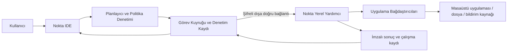

# Nokta Yerel Yardımcı Servis Mimarisi

**Amaç:** Nokta IDE’de yazılan, açıkça izin verilmiş otomasyonların kullanıcının kendi bilgisayarındaki masaüstü uygulamaları, dosyaları ve bildirim kaynaklarıyla güvenli biçimde çalışabilmesini sağlamak.

> Nokta IDE bir tarayıcı uygulamasıdır. Tarayıcı, güvenlik modeli gereği rastgele bir masaüstü programını başlatamaz veya işletim sistemi bildirimlerini okuyamaz. Bu nedenle gerçek entegrasyon, kullanıcının bilgisayarına kurulmuş ve yalnızca kullanıcının onayladığı işleri yapan bir **Yerel Yardımcı** ile kurulmalıdır.

## 1. Tasarım hedefleri

Yerel yardımcı, Nokta kodunun işletim sisteminde sınırsız yetkiyle çalışması anlamına gelmez. Nokta kaynak kodu önce bir **eylem planına** dönüştürülür. Bu plan; izinler, hedef uygulama, veri kapsamı, zaman sınırı ve işlem kimliğiyle birlikte değerlendirilir. Yardımcı yalnızca kendi izin politikasıyla eşleşen planları çalıştırır ve imzalı bir çalışma kaydı üretir.

| Hedef | Tasarım kararı |
|---|---|
| Kullanıcı kontrolü | Her uygulama, dosya konumu, bildirim kaynağı ve ağ hedefi açık izinle tanımlanır. |
| Güvenli çalışma | Varsayılan olarak serbest kabuk komutu, keylogger, ekran kaydı ve sınırsız dosya erişimi yoktur. |
| Denetlenebilirlik | Her görev için eylem planı, onay, başlangıç/bitiş, çıktı özeti ve hata kaydı tutulur. |
| Dayanıklılık | Yinelenen görevler benzersiz işlem anahtarıyla idempotent çalışır; ağ kesilince kuyruk yeniden denenir. |
| Taşınabilirlik | Dil sözleşmesi aynı kalır; bağdaştırıcı yalnızca Windows, macOS veya Linux ayrıntılarını kapsüller. |

## 2. Çalışma seçenekleri

Bu iki yaklaşım aynı izin ve eylem planı modelini kullanır. Hangi yaklaşımın seçileceği, görevlerin bilgisayar açıkken mi çalışacağına ve merkezi yönetim gereksinimine bağlıdır.

| Yaklaşım | Nasıl çalışır? | Artısı | Sınırı | Kurulum |
|---|---|---|---|---|
| **Yerel-odaklı yardımcı** | IDE, eşleştirilmiş yardımcıyla yalnızca kullanıcının bilgisayarında konuşur. Zamanlama da cihazda tutulur. | Veri cihazdan çıkmadan çalışır; basit ve düşük maliyetlidir. | Bilgisayar ve yardımcı kapalıyken görev çalışmaz. | IDE + yerel yardımcı kurulumu |
| **Merkezî denetim + yerel yardımcı** | Zamanlama, kuyruk ve denetim kaydı merkezî hizmette; yardımcı ise dışa doğru kalıcı bağlantıyla görev alır. | Birden çok cihaz, görünür görev geçmişi ve daha dayanıklı zamanlama sağlar. | Sunucu tarafı kimlik, kayıt ve gizli anahtar yönetimi gerekir. | IDE + yardımcı + denetim hizmeti |

Yerel uygulama açma veya işletim sistemi bildirimi alma için her iki seçenekte de yerel yardımcı zorunludur. Merkezî hizmet, yardımcıya doğrudan dışarıdan port açmaz; yardımcı kendi tarafından başlattığı şifreli bağlantıyla iş talep eder. Böylece ev/ofis ağında ek açık giriş noktası oluşturulmaz.

## 3. Başvuru mimarisi



| Katman | Sorumluluk | Güvenlik sınırı |
|---|---|---|
| **Nokta IDE** | Kod yazma, önizleme, görev geçmişini görüntüleme ve kullanıcı onayı alma | Güvenilmeyen kullanıcı arayüzü; işletim sistemi yetkisi yoktur. |
| **Planlayıcı ve politika denetimi** | Nokta kodunu eylem planına indirger; izin, cihaz, hedef ve zaman politikasını doğrular | Uygulama kimliği ile kullanıcı politikasını birlikte doğrular. |
| **Görev kuyruğu** | Zamanlanmış/olay tabanlı işleri sıralar; tekrar denemeyi ve idempotency anahtarını yönetir | Ham kişisel veri değil, en az gerekli görev metaverisini tutar. |
| **Yerel yardımcı** | Eşleşmiş cihazda planı doğrular, bağdaştırıcı çağırır ve makbuz üretir | Cihaz anahtarı, yerel politika ve kullanıcı onayı burada uygulanır. |
| **Uygulama bağdaştırıcısı** | Belirli uygulamanın desteklediği güvenli eylemi yerine getirir | Uygulamaya özgü, dar kapsamlı API/eklenti erişimi kullanır. |

## 4. Yerel yardımcı tasarımı

Yerel yardımcı, işletim sistemiyle birlikte başlayan küçük bir servis ve kullanıcının görebileceği bir tepsi uygulamasından oluşur. Tepsi uygulaması; hangi cihazın eşleştirildiğini, hangi izinlerin aktif olduğunu, kuyrukta bekleyen işleri ve son çalıştırmaları gösterir. Yardımcı, kullanıcı hesabı altında çalışır; yönetici yetkisi yalnızca kurulum sırasında gerekliyse ayrı ve açık bir onayla istenir.

### 4.1 Cihaz eşleştirme

1. IDE, kullanıcıdan **“Bu cihazı eşleştir”** onayı ister ve kısa ömürlü tek kullanımlık eşleştirme kodu üretir.
2. Yerel yardımcı kodu doğrular, cihaz için bir anahtar çifti üretir ve genel anahtarı denetim hizmetine kaydeder.
3. Kullanıcı, yardımcı penceresinde cihaz adını ve istenen ilk izin kapsamını görerek onay verir.
4. Bundan sonraki her görev, cihaz kimliği, kısa ömürlü erişim belirteci, eylem planı özeti ve politika özeti ile gelir.

Eşleştirme belirteçleri kalıcı sır olarak IDE’nin tarayıcı depolamasında tutulmaz. Yardımcı, cihaz anahtarını işletim sisteminin güvenli kimlik kasasında saklar. Cihaz kaldırıldığında merkezî kayıt geçersizleştirilir ve yardımcı yeni görev kabul etmez.

### 4.2 Dar kapsamlı bağdaştırıcılar

Bağdaştırıcılar genel amaçlı “her komutu çalıştır” arayüzü sunmamalıdır. Her bağdaştırıcı, açık eylem şemaları ile sınırlandırılır.

| Bağdaştırıcı | Örnek izin | Kabul edilen eylem | Reddedilen davranış |
|---|---|---|---|
| Dosya | `izin dosya "Raporlar/"` | Onaylı klasörde CSV/JSON okuma veya yazma | Kullanıcı klasörünün tamamını tarama |
| Uygulama | `izin uygulama "Tarayıcı"` | Tanımlı uygulamayı başlatma, odaklama veya kapatma | İsimsiz yürütülebilir çalıştırma |
| Bildirim | `izin bildirim "Takvim"` | Seçili uygulamanın onaylı olayını dinleme | Tüm sistem bildirimlerini gizlice toplama |
| Ağ | `izin ag "api.ornek.com"` | İzinli alan adına HTTPS isteği | Her adrese sınırsız istek veya yerel ağa tarama |

Bir uygulama resmi API, eklenti veya otomasyon kancası sağlıyorsa öncelik bu bağdaştırıcıdadır. Ekran üzerinden tıklama gerektiren erişilebilirlik otomasyonu en son tercih olmalıdır; yalnızca belirli pencere/eylem için kullanıcının açık onayıyla çalıştırılmalıdır.

## 5. Nokta eylem planı sözleşmesi

Nokta yorumlayıcısı dış etki içeren her ifadeyi önce plan öğesine dönüştürür. Aşağıdaki plan, taşıma katmanından bağımsızdır ve hem önizlemede hem gerçek yardımcıda aynı biçimde görünür.

```json
{
  "taskId": "task_01HQ...",
  "idempotencyKey": "sha256(akış+zaman+girdi)",
  "expiresAt": "2026-08-25T09:05:00Z",
  "deviceId": "device_...",
  "policyHash": "sha256(izinler)",
  "actions": [
    { "type": "notification.watch", "target": "Takvim" },
    { "type": "application.open", "target": "Tarayıcı" },
    { "type": "notification.send", "message": "Gün başlangıcı akışı hazır." }
  ]
}
```

Yardımcı, planın süresini, cihazını, politika özetini ve eylem türlerini doğrular. Aynı `idempotencyKey` ile daha önce tamamlanan görev yeniden yan etki oluşturmaz; önceki makbuzu döndürür. Görev bağlantı kesilince bekliyorsa, zaman aşımına kadar kuyrukta kalır; süresi geçmişse açıkça **çalıştırılmadı** olarak kaydedilir.

## 6. Zamanlama ve olay modeli

`zamanla` ifadesi, bir zamanlama kuralına; `olay` ifadesi ise bir olay aboneliğine derlenir. Zamanlama hedef cihazın çevrim içi durumunu bilmeli, ancak her uygulama açılışında aynı işi iki kez çalıştırmamalıdır. Bu nedenle zamanlama kaydı; kural kimliği, hedef saat dilimi, son çalıştırma anahtarı, hedef cihaz ve kabul edilen gecikme penceresini içerir.

Olay kaynağı resmî webhook veya uygulama API’si sağlıyorsa olay doğrudan alınır. Sağlamıyorsa yardımcı, yalnızca kullanıcının seçtiği bağdaştırıcının dar kapsamlı durumunu uygun aralıkla kontrol eder. Dakika-altı takip veya açık WebSocket gerektiren senaryolarda kalıcı bir işlem gerekir; bu işlem kaynak ve maliyet açısından ayrıca planlanmalıdır.

## 7. Hata, onay ve denetim modeli

Nokta IDE’nin v0.4 tanı kartları, yerel yardımcıdan gelen makbuzlarla genişletilir. Her hata hem kullanıcıya okunabilir hem makine tarafından sınıflandırılabilir olmalıdır.

| Kod aralığı | Örnek | IDE davranışı |
|---|---|---|
| `NOKTA_1xx` | Ad, tür veya sözdizimi hatası | Kod satırını vurgular ve onarım önerir. |
| `NOKTA_2xx` | Veri kümesi veya CSV/JSON çözümleme hatası | Dosya rafına ve ilgili veri satırına yönlendirir. |
| `NOKTA_3xx` | Eksik/sona ermiş izin | İzin özetini gösterir; yeniden onay ister. |
| `NOKTA_4xx` | Cihaz çevrim dışı veya yardımcı yanıt vermiyor | Görevin kuyruk durumunu ve yeniden deneme zamanını gösterir. |
| `NOKTA_5xx` | Bağdaştırıcı/uygulama eylemi başarısız | Hedef uygulama, eylem ve güvenli hata özetini gösterir. |

Görev geçmişi, ham belge veya bildirim içeriği yerine varsayılan olarak zaman, hedef, eylem türü, sonuç kodu ve kısa özeti saklar. Tam hassas içerik kaydı, ayrı kullanıcı politikası olmadan tutulmaz.

## 8. Uygulama aşamaları

| Aşama | Teslim | Başarı ölçütü |
|---|---|---|
| 1 | Yerel yardımcı prototipi ve cihaz eşleştirme | IDE ile tek cihaz eşleştirilir; cihaz kaldırılabilir. |
| 2 | Dosya ve bildirim bağdaştırıcısı | Onaylı klasörde CSV/JSON okuyup Nokta akışına veri verir. |
| 3 | Uygulama bağdaştırıcısı ve kullanıcı onayı | Tanımlı uygulama için plan/önizleme/çalıştırma makbuzu oluşur. |
| 4 | Zamanlama, kuyruk ve tekrar deneme | Çevrim dışı cihaz görevi tekrar etmeden güvenli biçimde tamamlar veya süre aşımına düşer. |
| 5 | Birden çok cihaz ve merkezi denetim | Kullanıcı cihaz/izin/görev geçmişini tek panelden yönetir. |

Uygulamaya geçmeden önce kullanıcıdan yalnızca şu seçimler gerekir: hedef işletim sistemi, ilk entegre edilecek uygulama(lar), yerel mi merkezî mi çalışma tercihi, ne kadar sık izleme yapılacağı ve sonuçların nerede gösterileceği.

## 9. Güvenlik kontrol listesi

Yerel yardımcı için yayıma hazır sürüm; imzalı güncelleme, yetki daraltma, anahtar kasa entegrasyonu, işlem günlüğü, görev son kullanma tarihi, hız sınırı, uygulama/klasör/alan adı izin listesi, kullanıcı görünür onayı ve tek adımlı acil durdurma içermelidir. Bu kontroller tamamlanmadan yardımcıya genel uygulama veya dosya yetkisi verilmemelidir.

